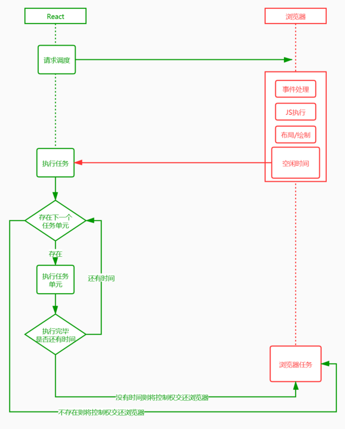
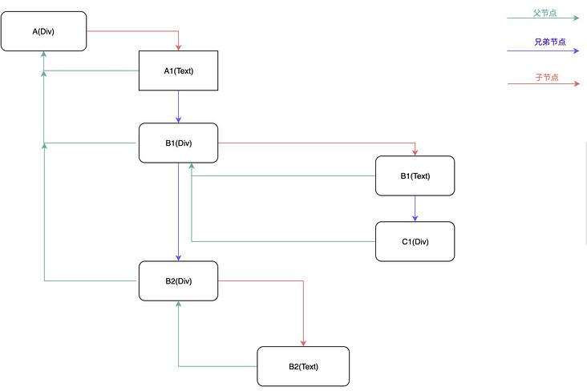
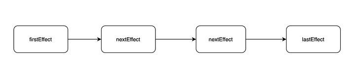
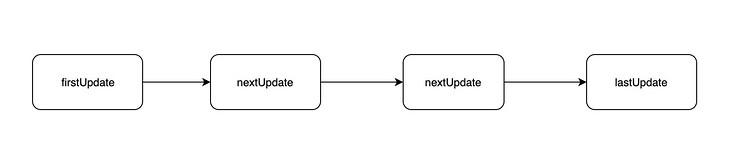

### StackReconcilation 架构总揽 （Stack： 栈）

- Reconciler（协调器）—— 负责找出变化的组件
- Renderer（渲染器）—— 负责将变化的组件渲染到页面上

特点： 采用递归的方式创建，Reconciler，不可中断
缺憾： 如果组件层级较深，递归占用线程事件长，超过 16ms（一帧），造成视觉卡顿

### FiberReconcilation 架构总揽 （Fiber： 纤维）

- Scheduler（调度器）—— 调度任务的优先级，高优任务优先进入 Reconciler
- Reconciler（协调器）—— 负责找出变化的组件：更新工作从递归变成了可以中断的循环过程
- Renderer（渲染器）—— 负责将变化的组件渲染到页面上

特点： Reconciler 异步可中断：
运算切割为多个步骤，分批完成，也就是说在完成一部分任务之后，将控制权交回给浏览器，让浏览器有时间进行页面的渲染，等浏览器忙完之后，再继续之前未完成的任务，所以使用 Fiber 架构的目的是让 Reconcilation 过程变成『可被中断』，适时地让出 CPU 执行权，让浏览器及时地响应用户的交互

### 浏览器信息必备

##### 1ms 有 60 帧，每一帧的过程：

    1. 接受输入事件
    2. 执行事件回调
    3. 开始一帧
    4. 执行 RAF (RequestAnimationFrame)
          requestAnimationFrame 是浏览器提供的一个用于优化动画效果的 API，它可以让浏览器在合适的时机（通常是每次重绘前）执行指定的回调函数，从而实现平滑、高效的动画效果。
    5. 页面布局，样式计算
    6. 绘制渲染
    7. 执行 RIC (RequestIdelCallback)
          RIC 事件不是每一帧结束都会执行，只有在一帧的 16.6ms 中做完了前面 6 件事儿且还有剩余时间，才会执行。

##### 结合 FiberReconcilation

    在浏览器渲染完一帧后，判断当前帧是否有剩余时间，如果有就恢复执行之前挂起的任务。如果没有任务需要处理，代表调和阶段完成，可以开始进入渲染阶段。

    把一个耗时长的任务分成很多小片，每一个小片的运行时间很短，虽然总时间依然很长，但是在每个小片执行完之后，通过RIC，RAF 将执行权，交还给浏览器，给其他任务一个执行的机会，这样唯一的线程就不会被独占，其他任务依然有运行的机会。

    React Fiber 把更新过程碎片化，每执行完一段更新过程，就把控制权交还给 React 负责任务协调的模块，看看有没有其他紧急任务要做，如果没有就继续去更新，如果有紧急任务，那就去做紧急任务。



### Fiber 链表结构信息必备

- 使用多向链表代替了原来的栈结构

  ```
  <div id="A">
  A1
  <div id="B1">
    B1
    <div id="C1"></div>
  </div>
  <div id="B2">
    B2
  </div>
  </div>
  ```

  

##### 优点

- <span style="color: red;">空间换时间： 方便根据优先级操作，方便挂起和恢复</span>
- 操作高效： 比如顺序调整，删除，只需改变节点的指针指向
- 多向链表，可以找到子父兄节点

##### 缺点

- 比栈（顺序结构）更占空间
- 不能自由读取，必须找到上一个节点

### Fiber 更新可控过程实现

##### vdom 创建，性能切片

- currentFiberTree 上次创建的 vdom 树
- workInProgressTree 当前正在执行更新的 FiberTree (关键在于创建过程的性能优化)

```
  步骤一： 在setState或者render后，构建一颗FiberTree
   1. 新 workInProgress 的节点通过 alternate 属性和 currentFiber 的节点建立联系
   2. 在创建新的workInProgressTree，会与currentFiberTree 的节点进行Diff比较，实现：
      !!!复用currentFiberTree的节点对象，减少创建对象的性能消耗
      !!!收集节点的副作用，为渲染提供更新链表
  步骤二： 在构建每一个节点会收集当前节点的副作用， 生成一条完整的副作用单链表
```

副作用单链表

状态更新单链表


##### 任务拆分

    化整为0的思想 - 将Reconclier阶段递归遍历Vdom任务，拆分成无数个小任务，每个任务负责一个节点处理

##### 任务挂起

    当第一个小任务完成后，先判断这一帧是否还有空闲时间，没有就挂起下一个任务的执行，记住当前挂起的节点，让出控制权给浏览器执行更高优先级的任务

##### 任务恢复

    在浏览器渲染完一帧后，判断当前帧是否有剩余时间，如果有就恢复执行之前挂起的任务。如果没有任务需要处理，代表调和阶段完成，可以开始进入渲染阶段

##### 任务优先级

- 每个 FiberNode，存在 expirationTime，<span style="color: red;">过期时间的大小还代表着任务的优先级</span>
- ！！！最终都是为了收集到这条副作用链表，有了它，在接下来的渲染阶段就通过遍历副作用链完成 DOM 更新。这里需要注意，更新真实 DOM 的这个动作是一气呵成的，不能中断，不然会造成视觉上的不连贯（commit）

###### 参考 url： https://zhuanlan.zhihu.com/p/439911498
