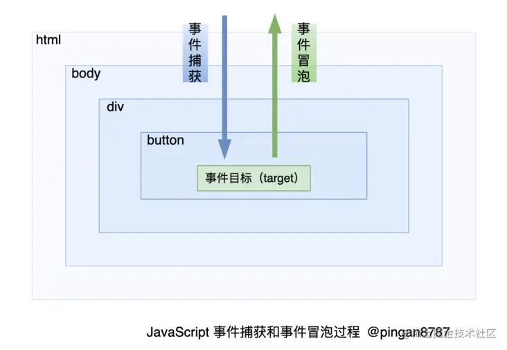

### 合成事件系统

##### 区别原生事件

- addEventListenner
- removeEvecntListenner
  

##### react 事件 - 模拟原生事件所有能力的一个事件对象，即浏览器原生事件的跨浏览器包装模拟器

###### 实现原因

- fiber，生成的 vdom 节点并未真实挂载
- onClick 事件处理函数作为 fiberNode 节点的 prop，不能被绑定真实 dom

###### 实现 - 顶层注册，事件收集，统一触发

- 基于浏览器的冒泡机制，实现了一套自身的事件机制，包括事件注册，事件合成，事件冒泡，事件派发等
- 事件绑定：
  1. 在 jsx 中绑定的事件并没有注册到真实 dom 上，绑定在 root 组件统一管理
     React 通过队列的形式，从触发的组件向父组件回溯，然后调用他们 JSX 中定义的 callback
  2. 真实 dom 的 click 事件，被单独处理， 被 react 底层替换成空函数
  3. react 并非一开始就将所有事件绑定到 root，而是按需绑定
- 执行顺序
  原生 -> react -> root
  !!! 原生事件阻止冒泡，会阻止合成事件，但是合成事件阻止冒泡，不会影响原生事件

###### 参考 url： https://segmentfault.com/a/1190000039108951
