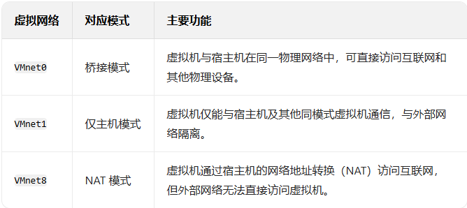

## 一: 区别两种模式
  https://blog.csdn.net/qq_27088383/article/details/108634985
  #### 1.1 NAT模式
    - 宿主机 有两个网卡，1 真实网卡，链接路由器，2 虚拟网卡，链接虚拟机
    - 虚拟网卡，可以被认为一个虚拟交换机，链接宿主机，和虚拟机，
    - 虚拟机访问外网，通过宿主机的ip地址，实则是通过端口转发配置，是虚拟机访问的
  
    
  #### 1.2 桥接模式
    - 在同一个网段内，创立了一个单独主机，可以访问这个局域网内所有的主机，但是需要手动配置ip，子网掩码
    - 和真实主机在同一个网段，nat是两个网段
    - 虚拟机和主机可以互相ping通
  

## 二： 基本知识储备

  #### 2.1 ipv4，子网掩码，网关，dns
  ```
  ipv4:           
      ip地址 = 网络地址 + 主机地址  
  子网掩码:        
      划分网络地址和主机地址，
  网关(gateway):   
      一个网络通向另一个网络的转发设备（通常是路由器或者防护墙的ip地址）
  子网ip：         
      某个子网内的可用地址
        - 确定可用 IP 范围  可用 IP = 网络地址 + 1 至 广播地址 - 1。
        - 广播地址可通过，ipconfig 命令查看
        - 案例: 例：192.168.1.1 至 192.168.1.254，共 254 个可用 IP（总 IP 数 - 2，减去网络地址和广播地址）
  dns:  
      域名服务器，将域名解析为ip地址，存储域名和ip对照表
  ```  
  

  
  #### 2.2 防火墙
   - 防止不安全服务通过虚拟机，渗透到宿主主机或者其他设备
   - 不同linux发行的防火墙工具不同，firewalld （centOs， rocky linux）  ufw （ubantu Debian）
   - 配置防火墙命令
   ```
    1. 检查服务是否已启用	
		# 查看当前开放的服务
		sudo firewall-cmd --list-services

		# 查看当前开放的端口（cockpit 可能以端口形式开放）
		sudo firewall-cmd --list-ports	
   
   2. 开放服务（若未启用） - 开放 SSH 服务
		# 若未开放，执行以下命令（--permanent 表示永久生效）
		sudo firewall-cmd --add-service=ssh --permanent
		
		# 开启22端口
		sudo firewall-cmd --add-port=22/tcp --permanent

		# 重载防火墙使配置生效
		sudo firewall-cmd --reload
		
		
   3. 验证配置是否生效
		# 查看已开放的端口
		sudo firewall-cmd --list-ports

		# 查看已开放的服务
		sudo firewall-cmd --list-services

		# 输出示例（应包含 22/tcp 或 ssh）：
		# ports: 22/tcp
    # services: ssh
   ```


  #### 2.3 CentOS,RockyLinux
  ```
  # 服务
  CentOS: 2024年已停服
  RockyLinux: ocky Linux是由CentOS联合创始人Gregory Kurtzer发起的一个开源项目，完全免费，用户可以自由下载和使用
  # 网卡配置文件路径不同
  CentOS: /etc/sysconfig/network-scripts
  RockyLinux: /etc/NetworkManager/system-connections/ 
  ```

  #### 2.4 nmcli - Network Manager 的命令行工具， 用于在Linux系统中配置和管理网络连接
  ```
  常用命令：
  # 查看 NetworkManager 总体状态
  nmcli general status

  # 查看所有网络设备及其状态
  nmcli device status

  # 查看所有连接配置
  nmcli connection show
  # 连接到名为 "ens33" 的网络
  nmcli connection up ens33

  # 断开 "ens33" 连接
  nmcli connection down ens33

  # 激活设备（自动选择可用连接）
  nmcli device connect eth0

  # 更新后重载
  nmcli connection reload
  ```

  #### 2.5 网络适配器
  ```
  # 宿主机网络
      - ipconfig 可查看，对应ip
      - 点击当前可接入互联网的连接，查看详情，找到网卡名称（如： Intel(R) Ethernet Connection X722 for 1GbE #2）
      - 在桥接模式下，选择当前网卡名称，可连接互联网
  # VMvare Network Adapter VMnet8
      - 虚拟网卡，与宿主机网络通信，使得虚拟机可以访问互联网
  # VMvare Network Adapter VMnet1
      -  Host-Only 模式（仅主机模式）下的虚拟交换机，实现虚拟机与宿主机之间的 仅主机 模式的网络通信
      -  连接到 VMnet1 的虚拟机之间可以互相通信，且能与宿主机通信，但无法访问外部物理网络（如互联网），也不会被外部网络发现
  ```
  
    
## 三： 两种模式配置
#### Nat模式配置
  1. 新增虚拟机，选择nat模式，
  2. 点开网络和Internet -> 网络适配器 -> Vmvare NetWork Adapter Vmnet8 就是虚拟网卡
  3. 网络编辑器 -> NAT设置 -> 当前网络： vmnet8 记录网关（网卡配置文件 - connection 文件 需要的gateway参数）
               -> DHCP设置 -> 起始ip和结束ip中间的ip地址里，选择一个作为虚拟机的ip地址 （网卡配置文件 - connection 文件 需要的adress参数）
  4. 启动服务器，设置账号密码 root / 123456
  5. 修改网卡文件配置
     - cd /etc/NetworkManager/system-connections/
     - vi ens160.connection （文件名可能不同）
     - i (进入编辑模式)
     - 修改内容：
      ```
      [connection]
      id=ens160           
      uuid=123e4567-e89b-12d3-a456-426614174000  # 唯一标识符（使用默认参数）
      type=ethernet
      autoconnect=true

      [ipv4]
      method=manual
      addresses=上面复制参数/24
      gateway=上面复制参数
      dns=114.114.114.114;8.8.8.8;

      [ipv6]
      method=ignore           # 禁用 IPv6（可选）
      ```
  6. :wq 强保存并退出
  7. nmcli connection reload
     nmcli connection up ens160
     nmcli connection show   # 验证
  8. sudo firewall-cmd --add-port=22/tcp --permanent
     sudo firewall-cmd --reload
     sudo firewall-cmd --list-ports
     sudo firewall-cmd --list-services
     确保ssh 22端口开放
  9. 网络编辑器 -> NAT设置 
       添加端口ip映射
  10. xshell ssh 远程访问

              
#### 桥接模式
  1. 新增虚拟机，选择桥接模式，桥接网络选择宿主机网络
  2. 启动服务器，设置账号密码 root / 123456
  3. 修改网卡文件配置
     - cd /etc/NetworkManager/system-connections/
     - vi ens160.connection （文件名可能不同）
     - i (进入编辑模式)
     - 修改内容：
      ```
      [connection]
      id=ens160           
      uuid=123e4567-e89b-12d3-a456-426614174000  # 唯一标识符（使用默认参数）
      type=ethernet
      autoconnect=true

      [ipv4]
      method=manual
      addresses=子网ip范围内任选/24
      gateway=(ipconfig查看)
      dns=114.114.114.114;8.8.8.8;

      [ipv6]
      method=ignore           # 禁用 IPv6（可选）
      ```
  4. :wq 强保存并退出
  5. nmcli connection reload
     nmcli connection up ens160
     nmcli connection show   # 验证
  6. sudo firewall-cmd --add-port=22/tcp --permanent
     sudo firewall-cmd --reload
     sudo firewall-cmd --list-ports
     sudo firewall-cmd --list-services
     确保ssh 22端口开放
  7. xshell ssh 远程访问
