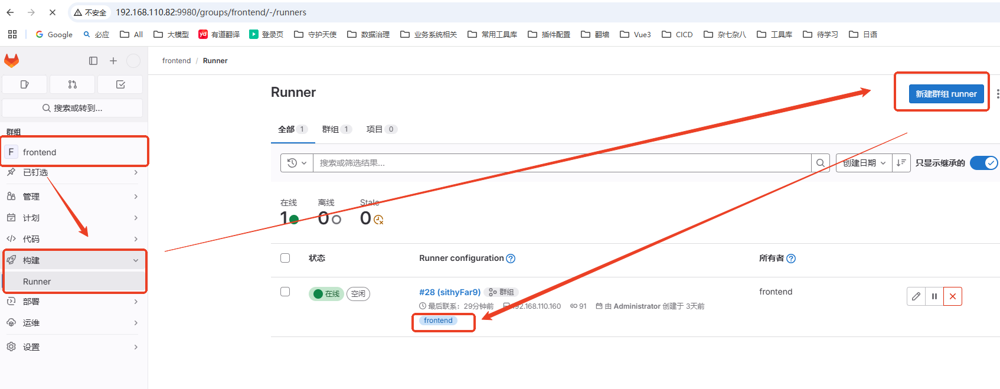

##  思路：
    1. 使用docker 安装，但是会面临，需要启动容器实现cicd，会出现docker in docker 的情况， 
       如果gitlab-runner的docker 容器出现问题，所有内容都会丢失，所以docker in docker 放弃
    2. 将runner 安装在服务器上，方便找到clone地址的位置，实现一层docker的cicd 
          使用一个docker ，实现两个阶段，build 和 nginx 代理阶段，Dockerfile 可以拿到第一阶段的结果，导入第二阶段

### 服务器安装
    由于，gitlab-runner 在安装过程中会创建一个权限最低角色的用户， 有两种方式提高该用户的权限 

    查看 gitlab-runner 的用户命令： ps aux|grep gitlab-runner
    
    直接安装，再配置用户 
        - sudo yum install gitlab-runner
        - ps aux|grep gitlab-runner  查看user账户 - gitlab-runner
        - sudo gitlab-runner uninstall   可以卸载掉gitlab-runner默认用户
        - sudo systemctl restart gitlab-runner
        - ps aux|grep gitlab-runner  再次查看user账户 - root

### 配置gitlab
   gitlab 页面   为群组创建runner 实例，注意使用的tag， 是gitlab-ci.yml 文件与gitlab相关联的tag
    
   ###### gitlab界面配置如下：

   


### 服务器注册 runner 
    sudo gitlab-runner register --url $URL --registration-token $REGISTRATION_TOKEN

    复制 gitlab界面生成的代码， sudo xxx  即可

### 配置文件
    服务器位置： /etc/gitlab-runner/config.toml 

## cicd  - gitlab 方式

### 前端自动化部署，实现方案

   ##### Dockerfile 与package.json 文件同级
    ```
    FROM node:18.18.1 AS build
    WORKDIR /app
    COPY . .
    RUN npm install pnpm -g --registry=https://registry.npmmirror.com
    RUN pnpm i --registry=https://registry.npmmirror.com
    RUN pnpm run build:dev

    FROM nginx
    RUN sed -i 's/MinProtocol = TLSv1.2/MinProtocol = TLSv1/' /etc/ssl/openssl.cnf \
    && sed -i 's/CipherString = DEFAULT@SECLEVEL=2/CipherString = DEFAULT@SECLEVEL=1/' /etc/ssl/openssl.cnf
    ENV TZ=Asia/Shanghai
    RUN ln -snf /usr/share/zoneinfo/$TZ /etc/localtime && echo $TZ > /etc/timezone
    WORKDIR /app
    COPY --from=build /app/dist ./
    COPY app-nginx.conf /etc/nginx/conf.d/app-nginx.conf
    EXPOSE 8080
    ```

   实现在同一个容器，运行两个阶段，第一阶段打包，第二阶段 代理
   将第一阶段的dist包文件拷贝到第二阶段，第二阶段启动nginx，暴露端口8080

   ######     一个dockerfile 两个from 创建了一个容器 ？？==
    在一个Dockerfile中使用多个 FROM 指令定义的是多阶段构建，而不是创建多个独立的容器。多阶段构建是 Docker 提供的一种机制，旨在帮助开发者优化最终生成的镜像大小，并提高构建过程的清晰度和安全性。
     
    多阶段构建简介
        在多阶段构建中，每个 FROM 语句开始一个新的构建阶段。你可以选择性地将前一阶段生成的文件复制到下一阶段，而不需要携带前一阶段的所有内容（例如，开发依赖、编译工具等），从而减少最终镜像的体积。
    
   
   ##### gitlab-ci.yml
   ```
     stages:
        - check
        - deploy
        - push

    variables:
    IMAGE_NAME: 'demomain'
    DEV_SUFFIX: 'dev'
    TEST_SUFFIX: 'test'
    PROD_SUFFIX: 'prod'
    NODE_VERSION: '18.18.1' #node版本

    check:
    stage: check
    tags:
        - frontend  
    before_script:
        - 'echo 开始构建项目......'
    script:
        - 'docker -v'
    only:
        - dev
        - test
        - master

    deploy-develop:
    stage: deploy
    tags:
        - frontend  
    before_script:
        - 'echo 执行构建部署流程'
    script:
        - 'echo ---------------------开始构建---------------------'
        - "sed -i 's/app-nginx.conf/app-nginx-dev.conf/g' 'Dockerfile'"
        - 'echo ---------------------删除上次容器 ---------------------'
        - 'docker ps -aq --filter "name=$IMAGE_NAME-$DEV_SUFFIX" | grep -q . && docker rm -f $IMAGE_NAME-$DEV_SUFFIX'
        - 'echo ---------------------创建容器 ---------------------'
        - 'docker build -t $IMAGE_NAME-$DEV_SUFFIX:1.0 .'
        - 'echo ---------------------启动容器 ---------------------'
        - 'docker run -d --name $IMAGE_NAME-$DEV_SUFFIX --restart=always -p 18290:8080 $IMAGE_NAME-$DEV_SUFFIX:1.0'
    only:
        - dev
   ```
   

   注意：  
       - "sed -i 's/app-nginx.conf/app-nginx-dev.conf/g' 'Dockerfile'" 
        这句：替换dockerfile中的nginx配置文件名，在多个环境下，可以使用同一个Dockerfile
