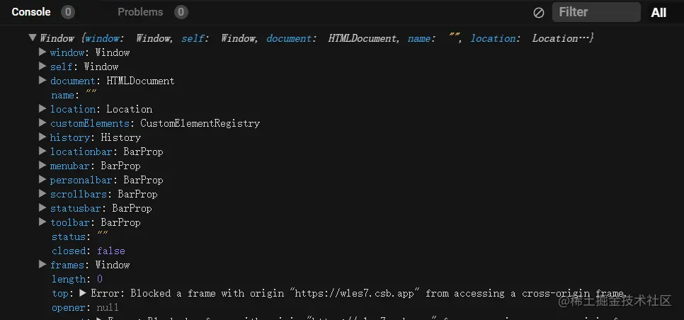

### 单页面应用
  - 浏览器从一开始，会加载必须的HTML，JS，CSS，所有的操作都在这张页面上完成，都由js 来控制，通过js动态控制页面中显示的内容，从而模拟出多个页面的效果

### SPA的原理
  - 通过JS监听到URL的变化，根据URL的变化来决定显示的页面

### SPA的实现： 需要前端路由监听URL的变化，从而对页面有所响应
  - 浏览器提供的API 
    

  - History
    - 浏览器提供的API 利用浏览器的 HTML5 history api 
         history.pushState(state, title, url)
         history.replaceState(state, title, url)
         history.go(n)
         history.back()
         history.forward()

- hash
    -监听url的hash来进行路由跳转
    

 