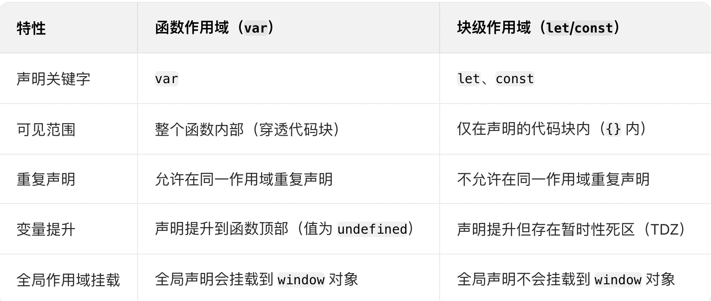

### 对比图



### let const 块级作用域

- 变量仅在{}可以访问，块外无法访问
- 代码块包括 if、for、while、switch 或独立的 {} 等

### var 函数作用域

- 由 var 声明的变量或函数声明（function）遵循此规则
- <span style="color: red;">即使在函数内的代码块（如 if、for）中声明，变量也会 “穿透” 到整个函数</span>

### 经典案例 - 循环中的变量隔离

```
// 函数作用域问题
for (var i = 0; i < 3; i++) {
  setTimeout(() => console.log(i), 100); // 输出 3 3 3（共享最终值）
}

// 块级作用域解决
for (let j = 0; j < 3; j++) {
  setTimeout(() => console.log(j), 100); // 输出 0 1 2（每次迭代有独立 j）
}
```
