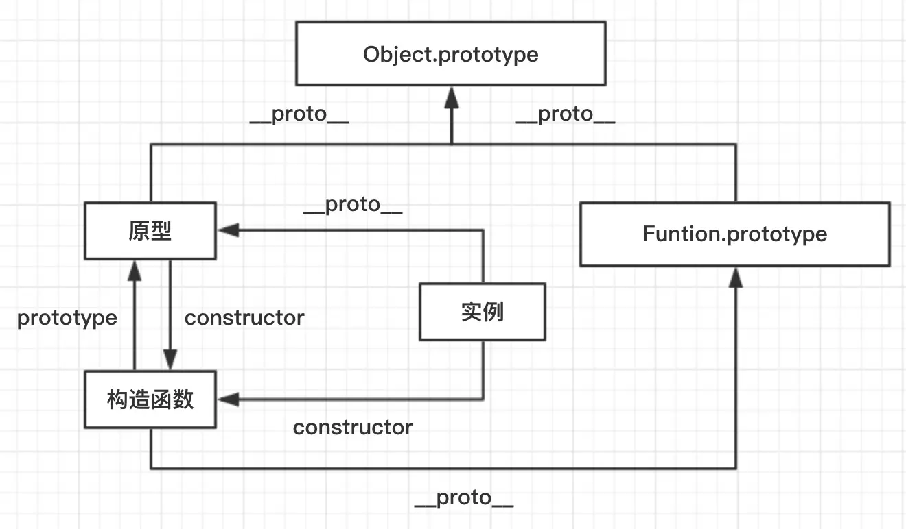

### 原型 / 构造函数 / 实例

实例._prototype_ = 原型
实例.constructor = 构造函数
原型.constructor = 构造函数
构造函数.prototype = 原型


###### 其实实例上，并没有 conturctor 这个指针，是从原型链上获取来的

### 原型链

原型链是由原型对象组成，每个对象都有一个*prototype*属性，指向了构造函数的原型，*proto*将对象链接起来组成了原型链。
一个用来实现继承和共享属性的有限对象链。

属性查找机制：
当查找对象的属性时，如果实例对象自身不存在该属性，则沿着*proto*这条链向上查找，直到找到为止。
到 null 截止。

### new 的过程 （apply & this）

1. 创建一个空对象
2. 将空对象的*proto*指向构造函数的原型
3. 将空对象的 this 指向构造函数
4. 执行构造函数
5. 返回空对象

```
function myNew (constructorFn, ...args) {
   // 1. 创建一个空对象
   const obj = {};
   // 2. 将空对象的__proto__指向constructor的prototype
   obj.__proto__ = constructorFn.prototype;
   // 3. 使用给定参数执行构造函数，并将 newInstance 绑定为 this 的上下文
        （换句话说，在构造函数中的所有 this 引用都指向 newInstance）。
   const res = constructorFn.apply(obj, args);
   // 4. 如果构造函数有返回值则返回res, 否则返回新对象
   return typeof res === 'object' ? res : obj
}
​
const p1 = myNew(Person, "jack");
p1.say();
```
