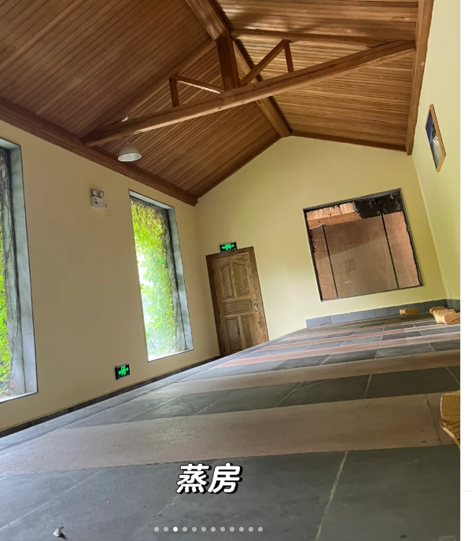

https://www.xiaohongshu.com/explore/683970c3000000002202a01a?xsec_token=ABTMMfTRuROSpxvLKw3PMCxRXiGl2jb3_R6nRTUzDwcow=&xsec_source=pc_search&source=unknown

天然温泉

和顺古镇

- 门票 7 天可多次使用

火山地质公园 乘坐热气球 俯瞰火山口

北海湿地

高黎贡 轻徒步

绮罗古镇 7-12 有早市 百年村

司莫拉佤族村 500 年村 游玩 2-3h

热海温泉景区 地热奇观 多个温泉区

来凤山公园，登顶俯瞰腾冲

以和顺古镇为中心

- 绮罗古镇 6.7km
- 热海景区 12km 65/人 （包含门票 ➕ 双程游览车）
- 司莫拉佤族村 15km 500 多年历史的原生态佤族古村落
- 北海湿地 22km 全价 55/人 中国首批 33 处国家重点湿地之一
- 火山地质公园 30km
- 叠水河瀑布 高 40m 6.5km
- 国殇墓园 免费 周二至周日 9:00-17:00（周一闭馆）

和顺古镇 距离市区 3.5km 住市区，打车或者找大巴出行

### day1

- 早起，火山地质公园，8 点前免门票，可坐热气球俯瞰火山口
- 泡温泉

### day2

- 上午，司莫拉佤族村 距离热海 12km
- 下午 热海景区泡温泉，8-18:30

### day3

- 北海湿地

## 温泉

- 石墙野温泉， ￥ 20，无人看守，泡脚舒服，硫磺温泉 距离市中心 48km
- 类似岩盘浴，
- 拉新温泉
- 北洞温泉 21km
- 洞山温泉 40+室内外汤池 一天
