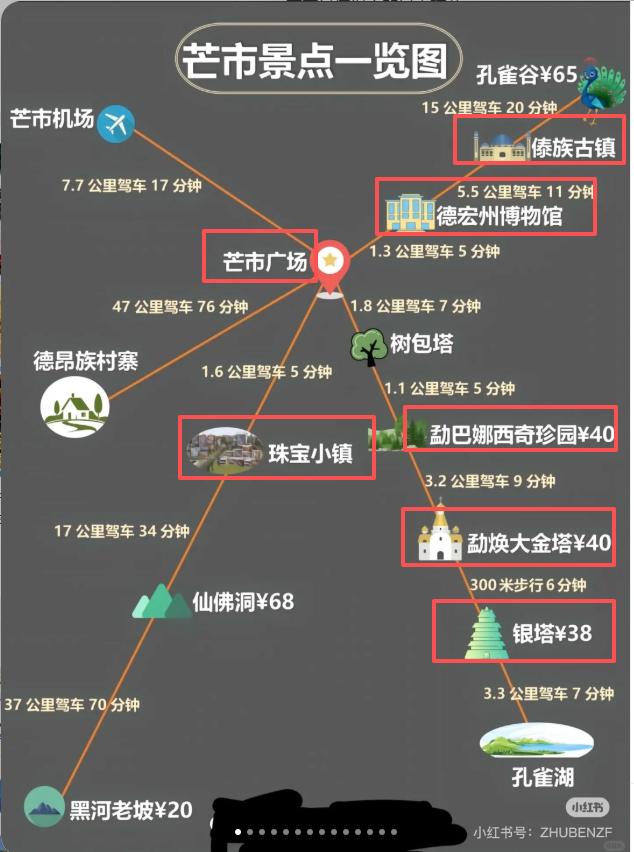

必去：

租电瓶车：主要交通工具，到处都有
紫外线很强： 防晒衣，墨镜，伞

1. 勐焕大金塔
2. 百思特美食城
3. 勐海大佛寺
4. 傣族古镇
   - 买傣装，￥ 40+
5. 勐巴娜西奇珍园
   - 建议下午 3 点后去，光线最出片！2-3h
6. 德宏博物馆
7. 新玩厂
8. 珠宝小镇
9. 丙午村集市
   - 对比 本地市场 宏利市场（水果，蔬菜集中， 看时间）
   - 每月特定日期开放，8:00–11:00 最热闹，下午部分收摊了
   - 山货
   - 东南亚特产：推荐“蔡姐太缅特产店”，性价比高
   - 越南卷粉
10. 古朴寨子 芒晃村 距离芒市广场 5km

day1:

1. 丙午村集市 可买服装 小摊老奶奶只收现金
2. 傣族古镇 可买服装
3. 德宏博物馆
4. 珠宝小镇
5. 团结大街，拍照出片
6. 芒市广场，夜景
7. 洗头

day2:

1. 勐焕大金塔
2. 勐焕大银塔
3. 勐巴娜西奇珍园
4. 树包塔
5. 新玩厂夜市

day3:

1. 芒晃村
