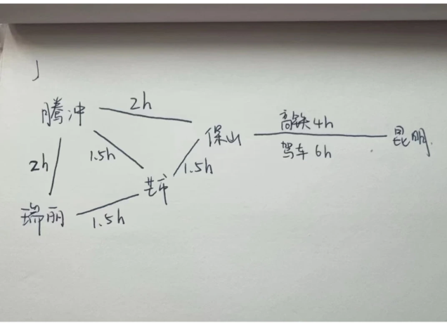

### 路线图



###### day1

- 早上: 昆明出发，前往保宁

```
早餐可选：
    1. 晨曦豆花米线 5.8km
    2. 董家湾76号小卷粉，3.8km
    3. 篆新市场 4.7 公里，值得一逛，有各种小吃 烧茄子，柠檬鸡，
```

- 中午：保宁

```
午餐可选：
    1. 阿明小吃 2.8km
    2. 美食街 3.8km
```

- 下午: 芒市
- 宏利市场，最大的水果市场，调料，干把，小零食，果干
- 木姜子，买几根带回家
- 瑞丽活螃蟹
- 银家早点
- 盗月社 https://www.xiaohongshu.com/explore/647968dd0000000027010f01?xsec_token=ABo3s5FsC8mXRvQVHEMgfazaglt6mj0BsRAmfXub0i8wQ=&xsec_source=pc_search&source=unknown
