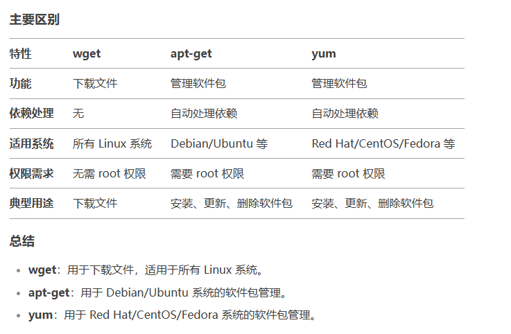

#### 服务器安装包命令总结

#### wget 
   命令行工具，用于从网络上下载文件。支持，HHTP，HTTPS，FTP协议。
   
   支持断点续传 - 会自动检测已经下载的部分，并从断点处继续下载剩余的文件内容。
   ```
   wget -c http://example.com/large_file.iso
   ```
   ###### 通用下载工具 ， 不涉及软件包管理，不会自动下载依赖包。
    
   
#### apt-get
   apt-get 是 Debian 和 Ubuntu 等基于 Debian 的 Linux 发行版中的包管理工具，用于安装、更新、升级和删除软件包。
   ###### 自动处理依赖关系， 需要 root 权限
   
   ```
   sudo apt-get install package_name
   ```
   
#### yum
  yum 是 Red Hat、CentOS 和 Fedora 等基于 RPM 的 Linux 发行版中的包管理工具，功能类似于 apt-get。

  ###### 自动处理依赖关系， 需要 root 权限
  ``` 
  sudo yum install package_name
  ```


