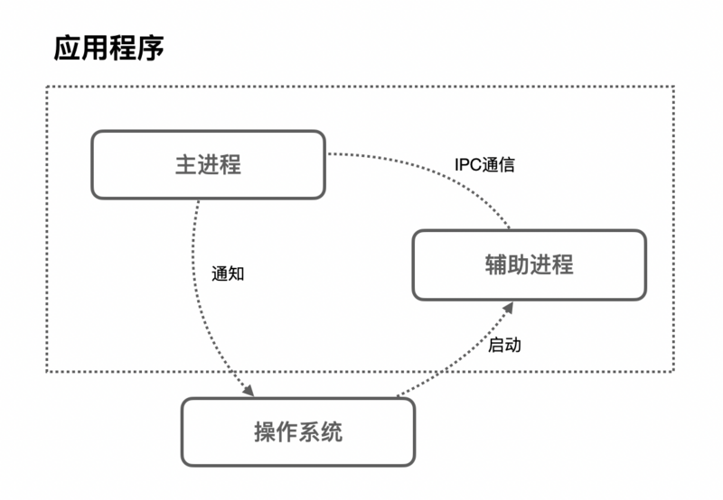
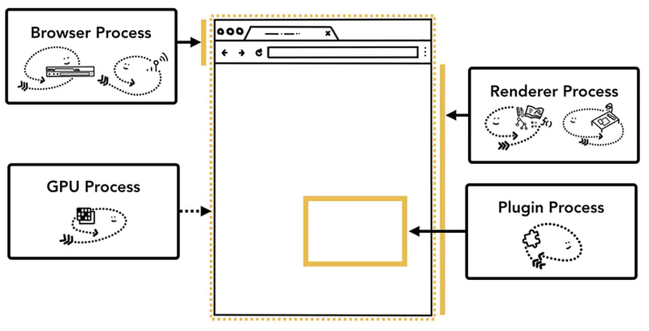
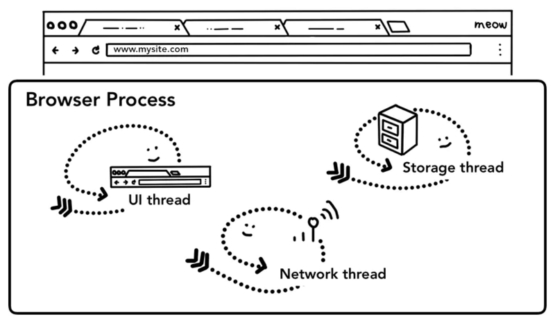

### 详情参见 url https://zhuanlan.zhihu.com/p/140700610
### 进程和线程
   - 进程： 是程序的一次执行过程，是一个动态概念，是程序在执行过程中，分配和管理资源的基本单位
   - 线程： 是CPU调度和分派的基本单位，他可与同属一个进程的其他线程共享进程所拥有的全部资源
   - 关系： 线程是跑在进程里面的，一个进程里面可能有一个或者多个线程，而一个线程，只能属于一个进程

### 浏览器
   - 启动浏览器： 浏览器属于一个应用程序，而应用程序的一次执行，可以理解为计算机启动了一个进程，
                 进程启动后，CPU会给改进程分配响应的内存空间，进程完成应用程序的功能

                 但是应用程序中，为了满足功能的需要，启动的进程会创建另外新的进程来处理其他任务，这些创建出来的新的进程
                 拥有全新的独立的内存空间，不能与原来的进程共享内存，如果这些进程之间需要通信，可以通过IPC机制
   
      

### 浏览器的多进程架构
   主要进程分4个
   - 浏览器进程(Browser Process)： 负责浏览器TAB的前进，后退，地址栏，书签栏的工作和处理浏览器的一些不可见的底层操作，比如网络请求和文件访问
   - 渲染进程(Render Process)：   负责一个tab内的显示相关的工作，也称渲染引擎
   - 插件进程(Plugin Process):   负责控制网页使用的插件
   - GPU进程(GPU Process)：   负责处理整个GPU相关的任务

   

### 多进程架构的好处
 - 更高的容错性
      多进程使得每一个渲染引擎，运行在各自的进程里，相互之间不受影响，也就是说，当一个页面挂掉，其他页面还可以正常运行不受影响
 - 更高的安全性和沙盒性
      浏览器为不同进程限制了不同的权限，并为其提供沙盒运行环境，更安全可靠
 - 更高的响应速度
      在单进程，各个任务互相竞争抢夺cpu资源，是的浏览器响应速度变慢，多进程恰好规避了这一点

### 网络加载的过程
 - UI Thread： 控制浏览器上的按钮和输入框
 - network thread： 浏览器的网络请求
 - storage thread： 控制文件等的访问

 

 1. 处理输入： UI Thread 会判断输入的内容是搜索关键词(打开默认搜索引擎的URL)，还是URL(开始请求URL)
 2. 开始导航： UI Thread 姜关键词搜索对应的URL交给网络线程的net work thread，网络进程进行一系列诸如DNS寻址等资源请求
 3. 读取响应:  net work thread接收到服务器响应后，开始解析HTTP响应保温，然后根据响应头的Content Type字段来确定响应主题的媒体类型
              如果是一个HTML文件，则将相应数据交给渲染进程 Render Process，如果是ZIP文件或者其他文件，会把数据传输给下载管理器
 4. 查找渲染进程：  
              各种检查完毕后，net thread确定浏览器可以导航到请求网页，net thread 会通知ui thread 数据已经准备好，ui thread会
              查找到一个render process 进行网页的渲染

 5. 提交导航： 到了这一步，数据和渲染进程都准备好了，Broswer Process发送一个IPC来确认导航，此时浏览器进程会向姜准备好的数据发送给渲染进程
              渲染进程接收到数据之后，有发送IPC给浏览器进程，告诉浏览器进程导航已经提交了，页面开始加载
              